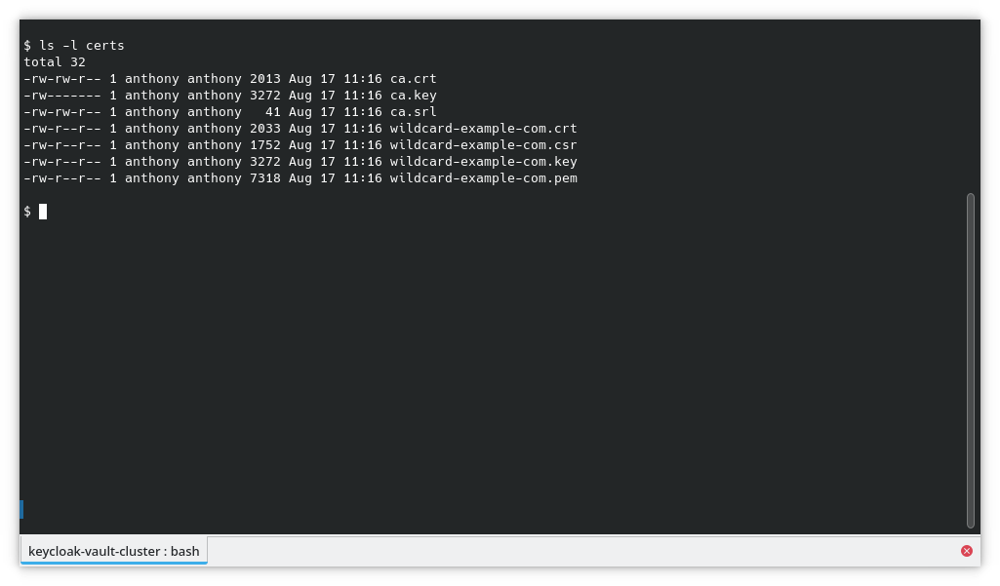

# Keycloak, Vault & Consul Integration

## Requirement
 - Linux
 - docker >= v26.0.0
 - docker compose >= v2.26.0
 - openssl >= v3.2.2
 - coreutils: `cat`, `grep`, `chmod`, `rm`, `make`

> **:information_source: Note**
>
> Run any of the commands below in the `keycloak-vault-consul` directory!

## Deployment

Keycloak and Vault require valid certificates with a CA, so we will generate our own CA and certificates.

```bash
make certificate
```


Certificates can be found in the certs directory.
```bash
ls -l certs
```


Start all containers: Keycloak with PostgreSQL as the database, two Vault instances with Consul as the storage backend, and HAProxy as the Vault load balancer.

```bash
make up
```


Now, we need to unseal the Vault. This command must be run whenever the Vault container is started or restarted.

```bash
make unseal
```


To get information such as the container IP addresses or the Vault root token, run the following command:
```bash
make info
```


To simplify access to the apps, add the `/etc/hosts` output from the `make info` command above to your `/etc/hosts` file.

```
# /etc/hosts
…
198.18.64.4 keycloak.example.com
198.18.64.7 vault.example.com
…
```

## Keycloak Configuration

Login to https://keycloak.example.com with user: `admin` , password: `password` .


> **:information_source: Note**
>
> Keycloak credentials can be configured in the `docker-compose.yaml` file.
> ```yaml
> # docker-compose.yaml
> …
> keycloak:
>   image: quay.io/keycloak/keycloak:25.0
>   container_name: keycloak
>   environment:
>     KEYCLOAK_ADMIN: admin
>     KEYCLOAK_ADMIN_PASSWORD: password
> …
> ```

Create a new realm in Vault by going to the menu, selecting the **Keycloak** drop-down menu, and clicking the **Create Realm** button.


Put `vault` as the **Realm name**


Next, create an OIDC client by navigating to the menu, selecting **Clients** and clicking the **Create Client** button.


Put `vault` as the **Client ID**


Check the **Client authentication**, **Standard flow** and **Service accounts roles**.


Put following URLs as the **Valid redirect URIs** and then click **Save** button
```
https://vault.example.com:8200/ui/vault/auth/oidc/oidc/callback
https://localhost:8250/oidc/callback
```


Go to the **Credentials** tab, and copy the **Client Secret** somewhere (`Copy to clipboard`).


Next, create a user by navigating to the menu, selecting **Users** and clicking the **Create new user** button.


Make sure to fill out all the form fields and click the **Create** button.


To set the password, go to **Credentials** tab, and click the **Set password** button and click **Save**, then **Save password** button.


## Vault Configuration

Login to https://vault.example.com:8200 with `Initial Root Token` taken from `make info` output as the token.


Enable the OIDC authentication method by going to the **Access** menu, selecting **Authentication Methods** and clicking the **Enable new method** button.


Choose **OIDC** and click **Enable method** button.


Put following details:

| Name | Value |
| ----------- | ----------- |
| OIDC discovery URL | `https://keycloak.example.com/realms/vault` |
|Default role|`default`|


Click **OIDC Options**, fill out with following details, and click **Save** button.

| Name | Value |
| ----------- | ----------- |
|OIDC client ID| `vault` |
|OIDC client secret|Credentials copied from Keycloak client credentials|
|OIDC discovery CA PEM|`ca.crt` in certs directory|
|Bound issuer|`https://keycloak.example.com/realms/vault`|


Now, click the terminal button in the upper left and enter the following command to create the `default` Vault role.

```
write auth/oidc/role/default allowed_redirect_uris="https://vault.example.com:8200/ui/vault/auth/oidc/oidc/callback" allowed_redirect_uris="https://localhost:8250/oidc/callback" user_claim="sub" policies="default"
```


Now, you can log out the Vault and login back in with the OIDC method.


Enter the same user and password from the Keycloak’s users we created previously.


Enter new password and click **Submit** button.


