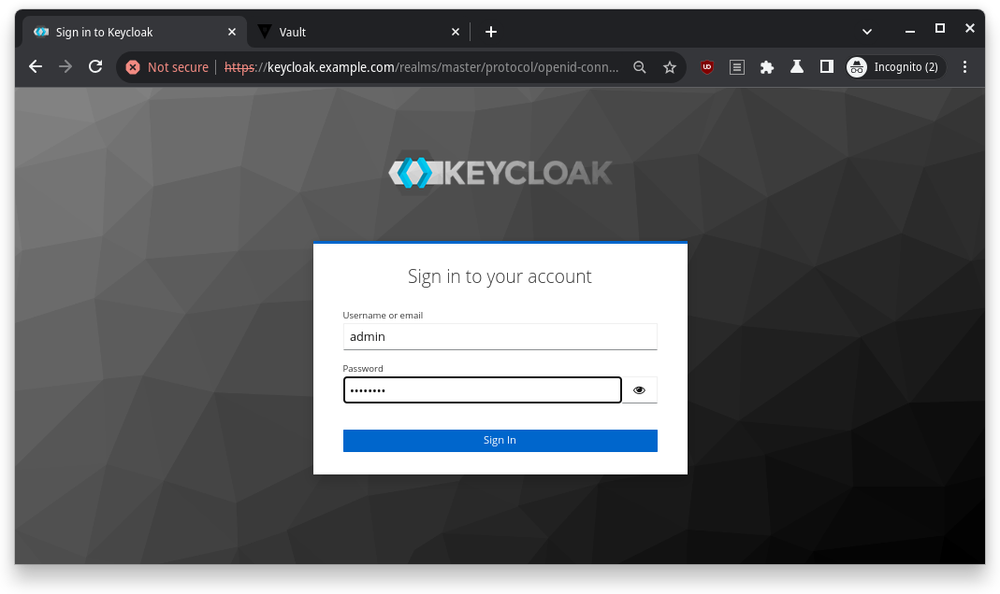

# Keycloak, Vault and Consul Integration

So, I recently picked up a cool project on Freelancer [(link)](https://www.freelancer.com/projects/docker/Docker-based-Hashicorp-Vault-Cluster) that involved integrating three powerful tools: **Keycloak**, **Vault**, and **Consul**. These are three powerful tools used for identity and access management, secrets management, and service discovery, respectively. If you're scratching your head and wondering, "What the heck are those?" don't worry – I'll walk you through the wild ride of setting them up, with all the bumps and fun along the way. Grab some popcorn, because this is going to be a fun one!

## The Setup

First things first – let's talk tools. These bad boys aren't the usual plug-and-play apps. They're more like the cool, techy superheroes of the DevOps world. Here's a quick rundown of the dream team I had to assemble:

* **Keycloak**: This is your go-to for identity and access management. Think of it as the bouncer at a super exclusive party, only letting in the right people (or apps).
* **Vault**: Vault is like a safe where you keep your most valuable secrets. In this case, that means all your API keys, tokens, and sensitive data.
* **Consul**: The service discovery wizard. It helps all the services talk to each other by knowing where each one is at any given time.

But before I could get these tools to play nice with each other, I needed a few things to make the magic happen:

* **Docker** (at least version 26.0.0, no pressure)
* **Docker Compose** (version 2.26.0 or higher)
* **OpenSSL** (because certificates are life)
* A handful of Linux utilities (you know, `cat`, `grep`, `chmod`, etc.)

> **Heads Up!**
>
> If you're planning on following along, make sure you're in the `keycloak-vault-consul` directory when running any of the commands. It's like the secret lair for this whole setup.

## Creating Certificates Like a Pro

The first step was to get our hands dirty with certificates. Both Keycloak and Vault are picky about security, so I had to make sure I had valid certificates. The solution? I created my own Certificate Authority (CA) and generated some certificates. Pretty standard stuff, but it felt like I was creating my own digital kingdom.

```bash
make certificate
```


Boom – certificates are ready! You can find them in the `certs` directory. Trust me, it's like a treasure chest full of digital gold.

```bash
ls -l certs
```


## Starting the Party: Bringing All Containers Online

Now that I had the certificates, it was time to fire up the containers. I needed:

* **Keycloak** with **PostgreSQL** as its database.
* **Two Vault instances** running with **Consul** as the backend storage.
* **HAProxy** to balance the **Vault** load.

It's like getting all the players on the field for a big game. I ran this command to start everything up:

```bash
make up
```


And just like that, I had a shiny new environment running. But wait – we're not done! Vault needs to be "unsealed" every time it starts up. That's Vault's version of "waking up" from its slumber. So I ran:

```bash
make unseal
```


## Getting the VIP Info

Now that the containers were up and running, I needed to grab some useful info, like container IPs and the Vault root token. This command did the trick:

```bash
make info
```


It spit out a bunch of useful details, including IPs and Vault's root token. I added these IPs to my `/etc/hosts` file so I could easily access the services via their friendly URLs:

```bash
# /etc/hosts
198.18.64.4 keycloak.example.com
198.18.64.7 vault.example.com
```

> **Pro Tip!**
>
> If you're on Docker Desktop (Windows or Mac), use `127.0.0.1` instead of the IP addresses. Otherwise, your containers might not play nice. Eg.
> ```
> # /etc/hosts
> …
> 127.0.0.1 keycloak.example.com vault.example.com
> …
> ```
>

## Keycloak Setup: Making Friends with Vault

Time to jump into **Keycloak**. I logged in to the Keycloak admin panel at https://keycloak.example.com, using the username `admin` and password `password` (don't worry, you can change these later).



> **Pro Tip!**
>
> You can customize the admin credentials in the docker-compose.yaml file. Super convenient if you're into that sort of thing.
> ```yaml
> # docker-compose.yaml
> …
>   keycloak:
>     image: quay.io/keycloak/keycloak:25.0
>     container_name: keycloak
>     environment:
>       KEYCLOAK_ADMIN: admin
>       KEYCLOAK_ADMIN_PASSWORD: password
> …
> ```

First task: create a new **realm**. In Keycloak, realms are like separate islands where your users and clients live.


 I clicked the **Create Realm** button and called mine `vault` (how original, right?).


Next, I created an **OIDC client** (basically a "passport" for Vault to authenticate through Keycloak). I named the Client ID `vault`, checked the authentication options, and added a couple of redirect URIs (more on that later).


Put following URLs as the **Valid redirect URIs** and then click **Save** button

```
https://vault.example.com:8200/ui/vault/auth/oidc/oidc/callback
https://localhost:8250/oidc/callback
```


The Client Secret was my golden ticket – I copied it and stored it safely, because I'd need it for Vault's setup.


Finally, I created a user and set their password. After clicking around a bit, I had everything ready to go in Keycloak.


## Vault Configuration: Getting Everything in Sync

With Keycloak prepped, it was time to jump into **Vault**. First, I logged in with the **Initial Root Token** that I grabbed earlier from `make info`.


Next, I enabled the OIDC authentication method – this is how Vault would authenticate using Keycloak.


I went to **Access** > **Authentication Methods**, clicked on **Enable new method**, and selected **OIDC**.


Then, I filled in the OIDC details:

| Name               | Value                                            |
|--------------------|--------------------------------------------------|
| OIDC Discovery URL | `https://keycloak.example.com:8443/realms/vault` |
| Default Role       | `default`                                        |


After that, I entered the credentials I got from Keycloak (the Client ID and Client Secret) and pointed Vault to my CA PEM file (`ca.crt`).

| Name                  | Value                                               |
|-----------------------|-----------------------------------------------------|
| OIDC client ID        | `vault`                                             |
| OIDC client secret    | Credentials copied from Keycloak client credentials |
| OIDC discovery CA PEM | `ca.crt` in certs directory                         |
| Bound issuer          | `https://keycloak.example.com:8443/realms/vault`    |


I also had to create a **Vault role** for OIDC. This role was like the VIP list, allowing only the right people to access Vault. Here's the command I used to create it:

```bash
write auth/oidc/role/default allowed_redirect_uris="https://vault.example.com:8200/ui/vault/auth/oidc/oidc/callback" allowed_redirect_uris="https://localhost:8250/oidc/callback" user_claim="sub" policies="default"
```


Now that everything was set up, I logged out and will try to login back into Vault using the **OIDC method**.

## The Grand Finale: Testing Everything

Once everything was set up, it was time for the ultimate test: logging into Vault via Keycloak. I went through the OIDC login flow, entered the credentials I'd set up in Keycloak, and voila! I was logged into Vault.


It was like watching a movie where all the heroes come together at the end, and everything just works. Cue the applause.

## Clean-Up: Wrapping It All Up

Finally, when I was done basking in the glory of my success, I cleaned up by tearing down all the containers. Running this command did the trick:

```bash
make clean
```

And just like that, my digital playground was put back in order, ready for the next adventure.

---

So, there you have it – my journey through integrating Keycloak, Vault, and Consul. It was a wild ride, filled with commands, configuration files, and a lot of fun moments. If you're ever tasked with setting up this trio, just remember: it's like assembling your own superhero team. Once you get the hang of it, the whole process becomes a well-oiled machine. And my GitHub project [here](https://github.com/antrusd/keycloak-vault-cluster) should make your life easier.

Thanks for following along with me! Until next time, happy hacking!
